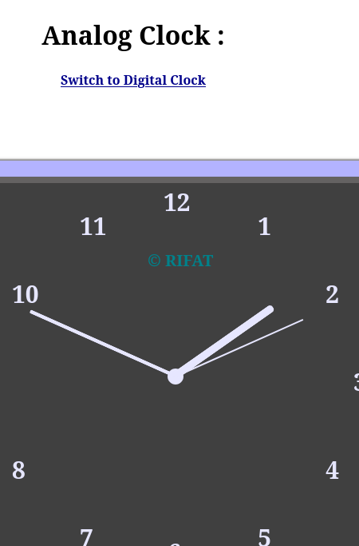
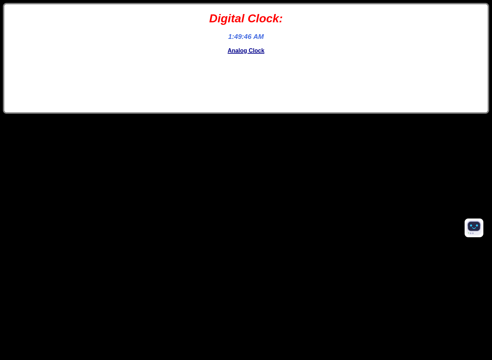
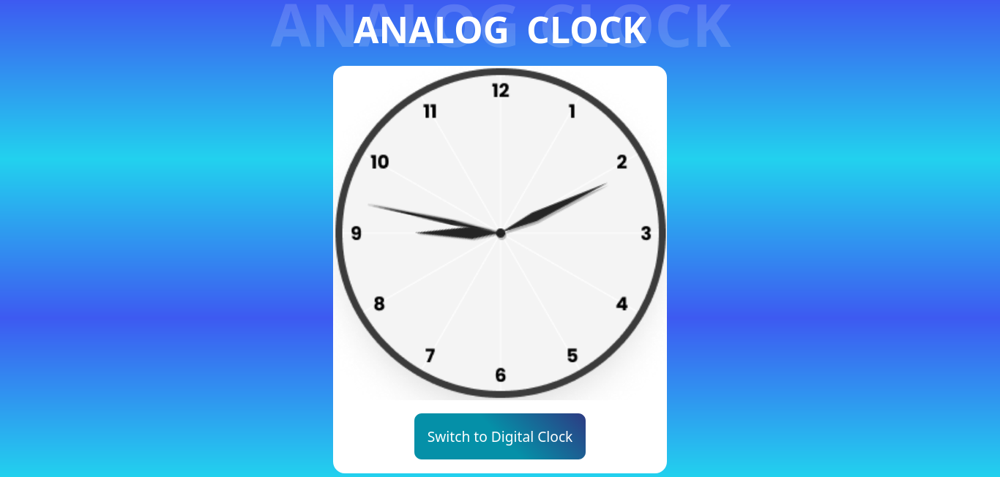
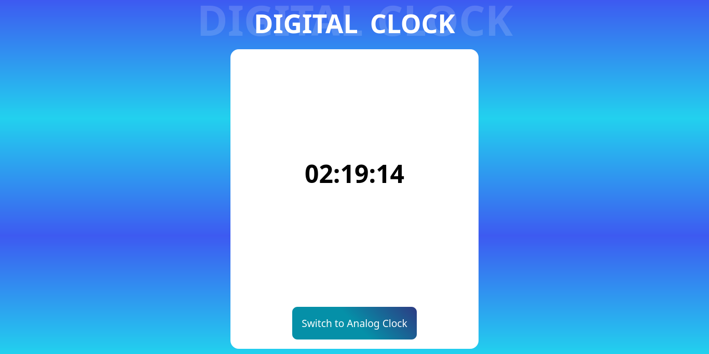

# Updating Clock Repository

## Overview
This repository contains the implementation of a clock that can toggle between an analog and digital display. The latest version improves upon the previous implementation by making it responsive, visually appealing, and better structured. The project allows users to compare the older version with the newly updated one.

---

## Features
### Previous Version
- **Not responsive**: The clock elements did not adapt to different screen sizes.
- **Basic design**: Minimal visual styling, resulting in a less appealing user interface.
- **Unstructured code**: Difficult to maintain and extend.

### Latest Version
- **Responsive design**: Works seamlessly on various devices, including desktops, tablets, and smartphones.
- **Eye-catching visuals**: Improved gradients, font styles, and animations for an attractive user experience.
- **Structured and maintainable code**: Organized JavaScript, CSS, and HTML for easier readability and future enhancements.

---

## How to Use
1. Clone the repository:
   ```bash
   git clone <repository-url>
   ```
2. Navigate to the project directory:
   ```bash
   cd updating-clock
   ```
3. Open `index.html` in your browser.
4. Use the toggle button to switch between analog and digital clock modes.

---

## File Structure
```
updating-clock/
├── index.html        # Main HTML and CSS file
├── script.js         # JavaScript for functionality
├── assets/           # Images and icons for the clock hands
├── previous_version/ # Files from the older implementation
│   ├── index.html
│   ├── styles.css
│   ├── script.js
└── README.md         # Project documentation
```

---

## Comparison
### Screenshots
**Previous Version**



**Latest Version**



### Key Improvements
| Feature                | Previous Version           | Latest Version            |
|------------------------|----------------------------|---------------------------|
| Responsiveness         | Not responsive            | Fully responsive          |
| Visual Design          | Basic and minimal         | Modern and eye-catching   |
| Code Structure         | Unorganized               | Structured and maintainable|
| User Interaction       | Limited styling           | Smooth animations and styling |

---

## Technologies Used
- **HTML5**: For structuring the webpage.
- **CSS3**: For styling and making the design responsive.
- **JavaScript**: For dynamic functionality and clock updates.

---

## Future Enhancements
- Add timezone support.
- Allow users to customize themes.
- Add support for 12-hour and 24-hour formats.

---

## Contributing
1. Fork the repository.
2. Create a new branch:
   ```bash
   git checkout -b feature-name
   ```
3. Commit your changes:
   ```bash
   git commit -m "Add feature description"
   ```
4. Push to your branch:
   ```bash
   git push origin feature-name
   ```
5. Open a pull request.

---
